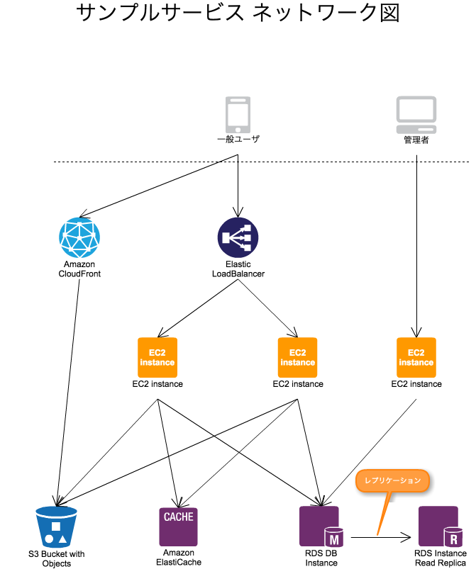

## サーバサイド・インフラ勉強会

* 平易な表現にするために、切り捨てた部分があるよ
* 私個人の意見・経験が含まれていますよ

---

## なので、 間違ってたら教えて下さい。

---

## 各構成要素の必要性

---

* CDN
* ロードバランサ
* WEBサーバ
* アプリケーションサーバ
* データベース
  * RDB
  * NoSQL
* ストレージサーバ

---

### Contents Delivery Network(CDN)

Amazon CloudFront とか Akamai とか。

* （主に静的な）リソースをキャッシュするよ
* 地理的に分散されているため、どこからでも高速にアクセス出来るよ
  * 世界展開するときとかは、特に必要になりそう

---

### ロードバランサ

Elastic Load Balancing（ELB）とか。

* WEBサーバを複数台並べるために使うよ
  * 1台で処理しきれないリクエストを捌けるようになるよ
* WEBサーバを監視して、死んでたらリクエストを送らないように設定できるよ

---

### WEBサーバ

Apache とか Nginxとか。

* 静的なリソース(HTML/CSS/JSなど)を返すよ
* 動的な処理はアプリケーションサーバに依頼(Reverse proxy)するよ

---

### アプリケーションサーバ

Tomcat とか Jetty とか Unicorn とか。

* JavaとかRailsのアプリケーションが動作するよ
* 動的なリソースを返すよ
  * DBの情報をJSON形式にして返したり
  * ログインユーザに合わせたHTMLを返したり

<small style="margin-top: 40px;">
物理的には、WEB＋アプリケーションで1台のサーバにすることが多いと思います。
</small>

---

### データベース（RDB）

MySQL とか PostgreSQL とか。

* 永続的な情報を保存するよ
* データ同士に関連性を持たせられるよ
* 読み込みはレプリカを増やせばスケールできるけど、書き込みがネックになると辛いよ

---

### データベース（NoSQL）

memcache とか Redis とか MongoDB とか。

* RDB以外をひとまとめに呼んでるだけなので、  
  いろいろな種類があるよ
  * memcacheは、一時的な情報を保存するのによく使われるよ
  * Redisは、memcacheに近い使い方も出来るし、  
  もうちょっと凝ったことも出来るよ
  * MongoDBは、巨大なデータを扱うときによく使われるよ
* ACID保証を提供しないことが多いよ

<small style="margin-top: 40px;">
データベースには色んな種類があるので、広く浅く知りたい人には [7つのデータベース 7つの世界](http://shop.ohmsha.co.jp/shop/shopdetail.html?brandcode=000000003596) がオススメ。</small>

---

### ストレージサーバ

S3 とか NFSで構築 とか。

* ユーザがアップロードした画像とかを保存するよ
* NFSとかを利用して、独自に構築してもいいけど、可用性・信頼性を考えるとS3を使ったほうがベターだよ

---

## ケーススタディ

この案件ではこうゆう要件があったので、こうゆう構成にした。など。

---

### 某WEBサービス

特に特殊な要件無し  
→ サービスが止まると困るので、WEB+APサーバは2台  
→ ELBで、WEB+APサーバの死活監視  
→ CloudWatch でELBに繋がるの台数を監視してメール通知

---

### 某SNS

特定のテーブルが1億レコード超え  
→ そのレコードへの書き込み・インデックスの再作成でサービス全体がたまに遅くなる  
→ そのテーブルのみ、物理サーバを別にすることで、影響範囲を限定  
  ただし、SQLによるJOINが使えなくなるので、アプリケーションの影響範囲は大きい

---

### 某SNS

PUSH通知の一斉配信対象が数万ユーザになった  
→ RabbitMQ により、キューイングしてから実行していたが、全員に配信完了するまで時間がかかる  
→ キューを処理するサーバプロセスを増加  
→ キューを処理するサーバ台数を増加

今だったら、Amazon SNS とか、Growth Push とか使ったほうがいいかもしれないですね。

---

### 某ゲーム

ユーザの動きによって、常時変動するようなランキング表示が必要  
→ 表示の度に得点の集計・順位付けは現実的ではない  
→ RedisのSorted Sets により、高速に計算・表示

---

## Infrastracture as a codeの話

* Provisioning Tools
* Configuration Management Tools
* Orchestration Tools

<small style="margin-top: 40px;">参考：  
[Linuxサーバ構築ツールまとめ](http://tkak.hatenablog.com/entry/2012/03/11/084905) 
[最近のインフラ系ツールが多すぎて何が何だかわからない！からの卒業](http://qiita.com/kasaharu/items/59b8d3a76b4a22eab88e)</small>

---

## Provisioning Tools

kickstart とか。

* よく知りません。

---

## Configuration Management Tools

chef とか puppet とか。

* Nginxとかのミドルウェアのインストール・設定を行うよ。

---

## Orchestration Tools

Capistrano とか fabric とか。

* デプロイとかするよ。

---

## とりあえず、以上です。

<small style="margin-top: 40px;">
つづく、かもしれない。
</small>
