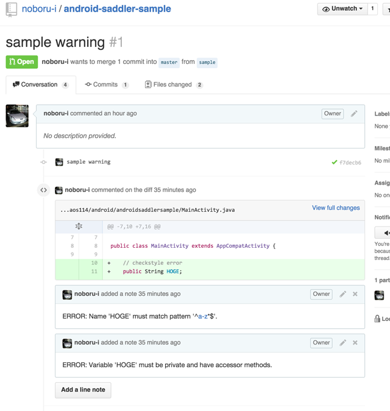
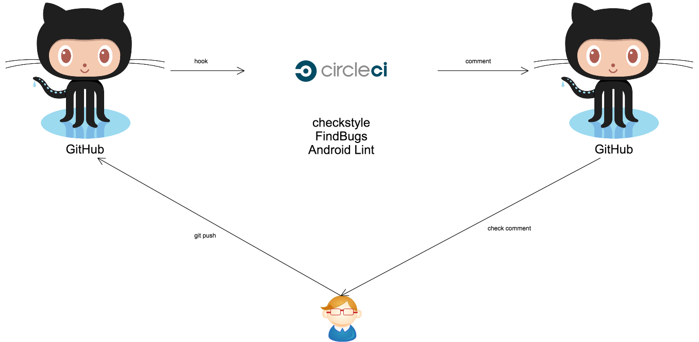
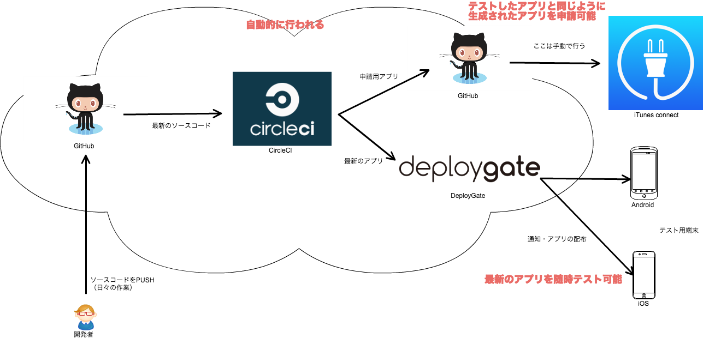

# メンターLT会

---

### 名前：石倉昇

- 1988年生まれ
- 所属：株式会社モンスター・ラボ
  - 肩書：テクノロジスト
- 勤務地：富山県自宅
- 得意領域：Android（？）

---

- グローバルソーシング事業
  - 受託型
  - 仲介型
- コンテンツ事業
  - 自社サービス（音楽・ゲーム・トラベル）
  - 共同サービス

---

## 2008年〜
富山のSIer  
業務系プログラマ  
ただし、半分は関東へ出張

## 2012年〜
株式会社モンスター・ラボ  
受託でアプリ・WEBの開発

---

他の人が有名すぎて、ビビってます。

---

# 最近注目している
# 技術など

---

## 自動化

---

## 例

---

## コードレビューの自動化

---

こんなん

---

イメージ

---

## テスト用アプリ配布の自動化

---

こんなイメージ

---

## サーバインフラの自動化

Dockerとか 
（まだ手を付けれて無い）

---

## 自動化は
## 最初にやるのは億劫ですが
## 早めにやっておくと
## 後から効いてきます

---

# どんなことが  得意か

---

### インフラ
### サーバ
### フロント
### Android・iOS
### などが、複数またがった作業が得意です。

---

### 例

- iOSの実装を見ながらAndroidを実装
- Androidで扱い易いサーバサイドのAPI設計
- フロントとネイティブのハイブリッドアプリの実装

---

## ぶっちゃけAndroid単体は
## もっと上手な人が
## たくさんいると思います。

---

## あとは

---

## 手抜きが得意かもしれません

---

### 素直に実装すると大変なことも、
### ちょっと制限を加える事で、
### 簡単に実装できたりします。

---

# 最後に

---

## 地方に住んでいるため、
## 対面で会う機会は少ないと
## 思います。

---

## ぜひ、懇親会でお話しましょう。

---

## 以上です。  ありがとうございました。
