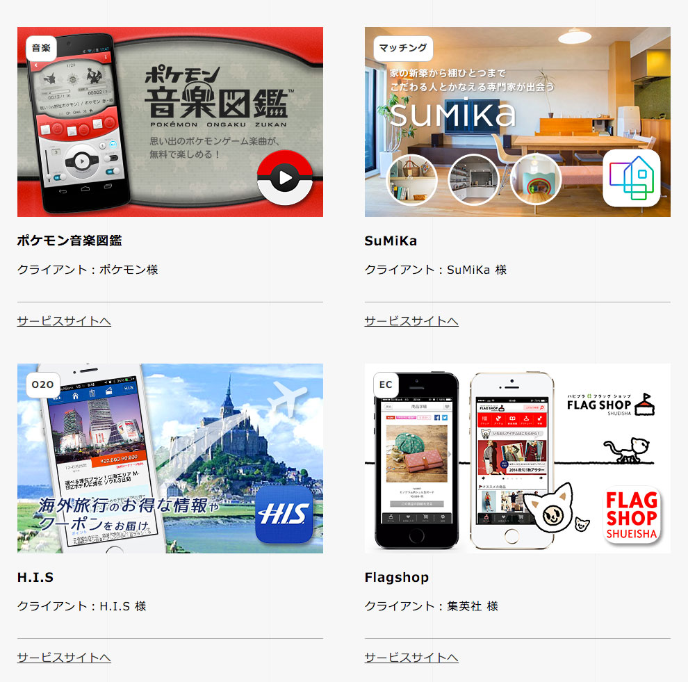
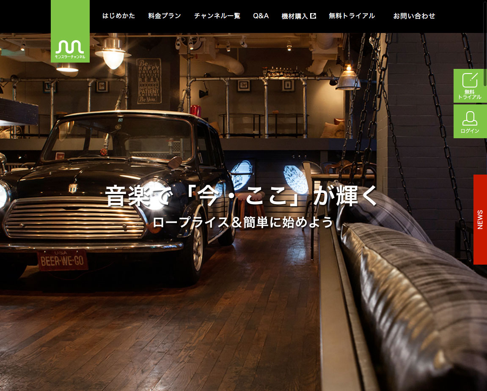
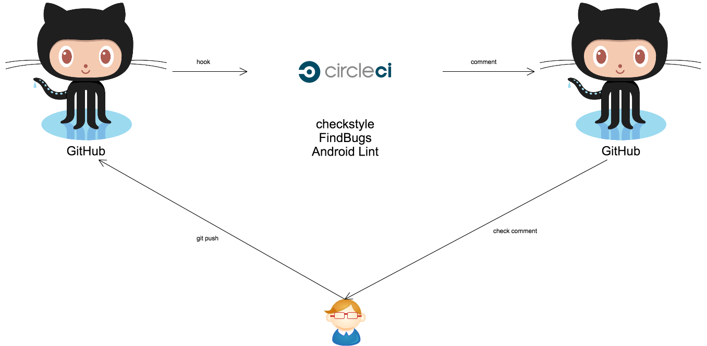
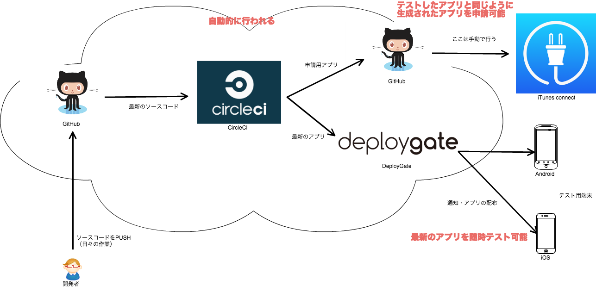

# メンターLT会

---

### who are you

- 石倉 昇
- 1988年生まれ
- 所属：株式会社モンスター・ラボ
  - サービス開発事業部 テクノロジスト
- 勤務地：富山県自宅
- 得意領域：Android（？）

---

### What is モンスター・ラボ

- グローバルソーシング事業
  - 受託型
  - 仲介型
- コンテンツ事業
  - 自社サービス（音楽・ゲーム・トラベル）
  - 共同サービス

---

### 受託の開発実績

<small>[http://monstar-lab.com/services/app/](http://monstar-lab.com/services/app/)</small>

---

### 店舗向けBGMサービス

<small>[http://monstar.ch/](http://monstar.ch/)</small>

---

### 略歴

- 2008年〜  
富山の中小SIerに入社  
債権債務のシステムを3次請けとか  
通信基盤システムの5次請けとか

- 2012年〜  
株式会社モンスター・ラボに転職  
受託でアプリ・WEBの開発

- 2015年〜  
富山でリモートワーク開始　←いまここ

---

### 個人活動

<small>[http://noboru-i.github.io/](http://noboru-i.github.io/)</small>

---

昨日からElectronを始めました。  
<small style="font-size: 30%; margin-top: 40px; ">たぶん、仕事で使うことはないけど...</small>

---

## 今日話すこと

- 最近注目している技術など

- どんなことが得意か

---

### 最近注目している技術など

### どんなことが得意か

---

## 自動化

---

## 例. 1
### コードレビューの自動化

---

---

イメージ

---

## 例. 2
### テスト用アプリ配布の自動化

---

こんなイメージ

---

## 例. 3
### アプリテストの自動化

---

- 今  
テスターさんの  
ひとつひとつ手作業による温かみのあるテスト

- これから  
Appiumによる自動テスト環境を構築中

---

## 例. 4
### サーバデプロイの自動化

---

流れはアプリとほぼ一緒で、  
GitHubにpushしたら、サーバにそれが反映されている。

---

自動化はするのは億劫ですが   
後から楽になります

---

締め切り間際に、  
細かなバグ修正→反映→確認  
を手作業で何度もやるのは辛い。

---

反映作業が自動化されていれば、  
細かなバグ修正→確認  
だけで済む。

---

### 最近注目している技術など

### どんなことが得意か

---

正直、"これ"といったものがありません 😔

---

経歴的には

- 日本語をJavaに翻訳（前職）
- PHPでサーバサイド
- Android/iOSでWEBとの  
ハイブリッドアプリ開発
- エンジニア自分1人のWEBアプリ開発
- iOSアプリのプロジェクトマネージャー
- ゲームのサーバサイドをRailsで開発
- 超短納期のAndroidアプリ開発
- プロジェクト横断の自動化促進

---

### インフラ
### サーバ
### フロント
### Android・iOS
### などが、複数またがった作業が得意です。

---

### 例

- iOSの実装を見ながらAndroidを実装
- Androidで扱い易いサーバサイドのAPI設計
- フロントとネイティブのハイブリッドアプリの実装

---

## ぶっちゃけAndroid単体は
## もっと上手な人が
## たくさんいると思います。

---

## あとは

---

## 手抜きが得意かもしれません

---

### 素直に実装すると大変なことも、
### ちょっと制限を加える事で、
### 簡単に実装できたりします。

---

# 最後に

---

## 地方に住んでいるため、
## 対面で会う機会は少ないと
## 思います。

---

## ぜひ、懇親会でお話しましょう。

---

## 以上です。  ありがとうございました。
