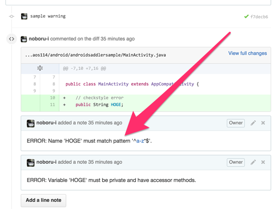

# メンターLT会

---

### who are you

- 石倉 昇
- 1988年生まれ
- 所属：株式会社モンスター・ラボ
  - サービス開発事業部 テクノロジスト
- 勤務地：富山県自宅
- 得意領域：Android（？）

---

### モンスター・ラボ

- グローバルソーシング事業
  - 受託型
  - 仲介型
- コンテンツ事業
  - 自社サービス（音楽・ゲーム・トラベル）
  - 共同サービス

---

### 受託の開発実績

<small>[http://monstar-lab.com/services/app/](http://monstar-lab.com/services/app/)</small>

---

### 店舗向けBGMサービス

<small>[http://monstar.ch/](http://monstar.ch/)</small>

---

### 略歴

- 2008年〜  
富山の中小SIerに入社  
債権債務のシステムを3次請けとか  
通信基盤システムの5次請けとか

- 2012年〜  
株式会社モンスター・ラボに転職  
受託でアプリ・WEBの開発

- 2015年〜  
富山でリモートワーク開始　←いまここ

---

### 個人活動

<small>[http://noboru-i.github.io/](http://noboru-i.github.io/)</small>

---

昨日からElectronを始めました。  
<small style="font-size: 30%; margin-top: 40px; ">たぶん、仕事で使うことはないけど...</small>

---

## 今日話すこと

- 最近注目している技術など

- どんなことが得意か

---

### 最近注目している技術など

### どんなことが得意か

---

## 自動化

---

## 例. 1
### コードレビューの自動化

---

---

イメージ

---

## 例. 2
### テスト用アプリ配布の自動化

---

イメージ

---

## 例. 3
### アプリテストの自動化

---

- 今  
テスターさんの  
ひとつひとつ手作業による温かみのあるテスト

- これから  
Appiumによる自動テスト環境を構築中

---

## 例. 4
### サーバデプロイの自動化

---

流れはアプリ配布とほぼ一緒で、  
GitHubにpushしたら、サーバにそれが反映されている。

---

自動化はするのは億劫ですが   
後から楽になります

---

締め切り間際に、  
細かなバグ修正→反映→確認  
を手作業で何度もやるのは辛い。😥

 

反映作業が自動化されていれば、  
細かなバグ修正→確認  
で済む。😄

---

### 最近注目している技術など

### どんなことが得意か

---

正直、"これ"といったものがありません 😔

---

経歴的には

- 日本語をJavaに翻訳（前職）
- PHPでサーバサイド
- Android/iOSでWEBとの  
ハイブリッドアプリ開発
- エンジニア自分1人のWEBアプリ開発
- iOSアプリのプロジェクトマネージャー
- ゲームのサーバサイドをRailsで開発
- 超短納期のAndroidアプリ開発
- プロジェクト横断の自動化促進

---

良く言えば

### "フルスタック"

 

悪く言えば

### "器用貧乏"

---

### 複数の技術が必要なことは得意かも

 

- iOSのコード読んでAndroidのコード書く
- スマホ側で扱い易いサーバサイドのAPI設計
- WEBとネイティブのハイブリッドアプリの実装

---

## 最後に

地方に住んでいるため、  
対面で会う機会は無いかもしれません。

その分、Slackなどのツールで  
十分に連絡とりながら進めていきたいと思います。

必要であれば、appear.inやskypeで会話も出来ます。

---

### ありがとうございました。
