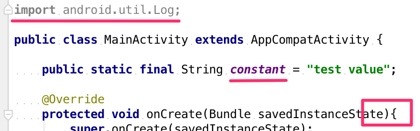
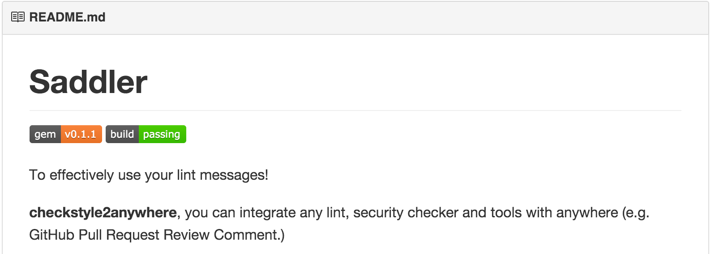
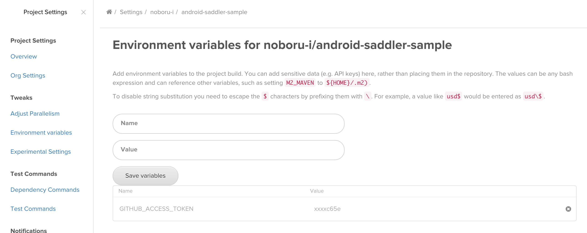
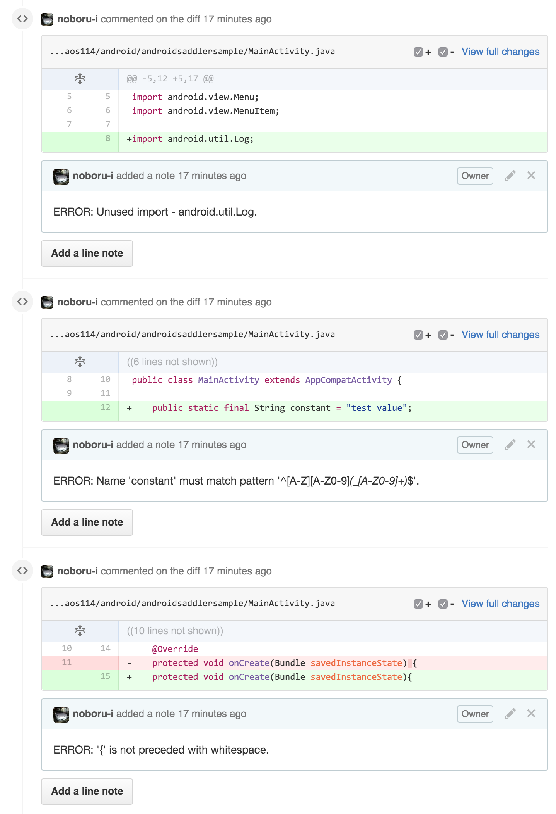

# Androidのコードを
# 自動で解析し
# GitHubのプルリクに
# コメントする

---

### who are you

- 石倉 昇
- 株式会社モンスター・ラボ所属
  - 受託でアプリとかWEBサービスとか作ってます
- 富山県の自宅でリモートワーク中
- Twitter : [@noboru_i](https://twitter.com/noboru_i)


---

### 個人活動

<small>[http://noboru-i.github.io/](http://noboru-i.github.io/)</small>


---

## 本題

---

たまにプルリクで上がってくるこんなやつ。



<small style="text-align: left;">
・未使用のimportが残ってる  
・static finalなのに、変数名が小文字  
・スペースが無い
</small>

---

「ここにスペースを入れて」とか  
いちいちレビューで指摘したくない。

---

「それ、Checkstyleで指摘してくれるよ。」

---

ならば

---

Checkstyleをみんなが<strong style="color: red;">忘れず</strong>守れば解決！

---

でも、忘れますよね。  

にんげんだもの

---

いっぽう、  
GitHubのプルリクに  
コメントあったら見ますよね？

---

Checkstyleの結果を  
コメントにしたらいいんじゃね？

---

既にありました。


<small>
[packsaddle/ruby-saddler](https://github.com/packsaddle/ruby-saddler)
</small>

---

あとは、pushしたらこれが動けばいい

---

ということで、  
CircleCIにやってもらいましょう。

---

こんな感じ


<small>
ついでなので、  
FindbugsとかAndroid Lintとか  
いろいろやってもらいましょう。
</small>

---

まず、CircleCIの環境設定をして、



---

build.gradleにチェック項目を追加して、

```
apply from: "https://raw.githubusercontent.com/monstar-lab/gradle-android-ci-check/1.1.0/ci.gradle"
```

<small>詳細は [monstar-lab/gradle-android-ci-check](https://github.com/monstar-lab/gradle-android-ci-check)</small>

---

saddler.shとして、  
チェックの実行と  
プルリクへの反映をするscriptを書き、

```
#!/usr/bin/env bash

echo "********************"
echo "* install gems     *"
echo "********************"
gem install --no-document checkstyle_filter-git saddler saddler-reporter-github findbugs_translate_checkstyle_format android_lint_translate_checkstyle_format pmd_translate_checkstyle_format

if [ $? -ne 0 ]; then
    echo 'Failed to install gems.'
    exit 1
fi

echo "********************"
echo "* exec gradle      *"
echo "********************"
./gradlew app:check

if [ $? -ne 0 ]; then
    echo 'Failed gradle check task.'
    exit 1
fi

echo "********************"
echo "* save outputs     *"
echo "********************"

LINT_RESULT_DIR="$CIRCLE_ARTIFACTS/lint"

mkdir "$LINT_RESULT_DIR"
cp -v "app/build/reports/checkstyle/checkstyle.xml" "$LINT_RESULT_DIR/"
cp -v "app/build/reports/findbugs/findbugs.xml" "$LINT_RESULT_DIR/"
cp -v "app/build/reports/pmd/pmd.xml" "$LINT_RESULT_DIR/"
cp -v "app/build/reports/pmd/cpd.xml" "$LINT_RESULT_DIR/"
cp -v "app/build/outputs/lint-results.xml" "$LINT_RESULT_DIR/"

echo "********************"
echo "* select reporter  *"
echo "********************"

if [ -z "${CI_PULL_REQUEST}" ]; then
    # when not pull request
    REPORTER=Saddler::Reporter::Github::CommitReviewComment
else
    REPORTER=Saddler::Reporter::Github::PullRequestReviewComment
fi

echo "********************"
echo "* checkstyle       *"
echo "********************"
cat app/build/reports/checkstyle/checkstyle.xml \
    | checkstyle_filter-git diff origin/master \
    | saddler report --require saddler/reporter/github --reporter $REPORTER

echo "********************"
echo "* findbugs         *"
echo "********************"
cat app/build/reports/findbugs/findbugs.xml \
    | findbugs_translate_checkstyle_format translate \
    | checkstyle_filter-git diff origin/master \
    | saddler report --require saddler/reporter/github --reporter $REPORTER

echo "********************"
echo "* PMD              *"
echo "********************"
cat app/build/reports/pmd/pmd.xml \
    | pmd_translate_checkstyle_format translate \
    | checkstyle_filter-git diff origin/master \
    | saddler report --require saddler/reporter/github --reporter $REPORTER

echo "********************"
echo "* PMD-CPD          *"
echo "********************"
cat app/build/reports/pmd/cpd.xml \
    | pmd_translate_checkstyle_format translate --cpd-translate \
    | checkstyle_filter-git diff origin/master \
    | saddler report --require saddler/reporter/github --reporter $REPORTER

echo "********************"
echo "* android lint     *"
echo "********************"
cat app/build/outputs/lint-results.xml \
    | android_lint_translate_checkstyle_format translate \
    | checkstyle_filter-git diff origin/master \
    | saddler report --require saddler/reporter/github --reporter $REPORTER
```

---

circle.ymlのtestとして実行するように設定。

```
test:
  override:
    - ./scripts/saddler.sh
```

---

あとは、修正をpushする度に  
CircleCIがチェックしてくれる。

---



---

統一されたフォーマット！

細かく指摘して嫌われない！

---

みんなHAPPY！

---

詳しくはWEBで。

[Androidのコードを自動で解析し、GitHubのpull requestにコメントする - Qiita](http://qiita.com/noboru_i/items/2f30296db1c8a6dfbd9b)

---

WE ARE HIRING!

[株式会社モンスター・ラボ - Wantedly](https://www.wantedly.com/companies/monstarlab)


---

### ありがとうございました。
