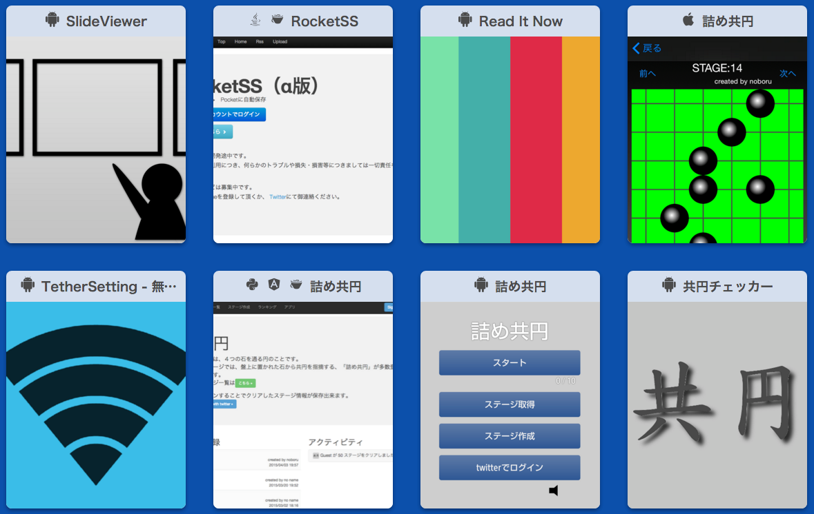

# Androidのコードを
# 自動で解析し、
# GitHubのPRに
# コメントする

---

### who are you

- 石倉 昇
- 株式会社モンスター・ラボ所属
  - 受託でアプリとかWEBサービスとか作ってます
- 富山県の自宅でリモートワーク中

---

### 個人活動

<small>[http://noboru-i.github.io/](http://noboru-i.github.io/)</small>

---

## 本題

---

他人の書いたコードでよく見かけるこんなやつ。

TODO インデントのズレ・定数なのに小文字・末尾の空白

---

「インデント、ズレてますよ」とか  
いちいちレビューで指摘したくない。

---

Checkstyleをみんなが<strong style="color: red;">忘れず</strong>守れば解決！

---

でも、忘れますよね。  
にんげんだもの

---

一方、  
GitHubのプルリクに  
コメントあったら見ますよね？

---

Checkstyleの結果を  
コメントにしたらいいんじゃね？

---

既にありました。

---

あとは、pushしたらこれが動けばいい

---

こんな感じ

---

TODO circle.ymlの設定・sadder.shの中身をちょっと見せる

---

で、こうなる

---

詳しくはWEBで。

[Androidのコードを自動で解析し、GitHubのpull requestにコメントする - Qiita](http://qiita.com/noboru_i/items/2f30296db1c8a6dfbd9b)

---

WE ARE HIRING!

[株式会社モンスター・ラボ - Wantedly](https://www.wantedly.com/companies/monstarlab)

---

### ありがとうございました。
