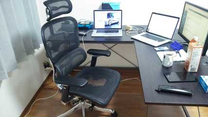

## jQueryを使った怖い話

---

### who are you

- 石倉 昇
- 株式会社モンスター・ラボ所属
  - 受託でアプリとかWEBサービスとか作ってます
- 富山県の自宅でリモートワーク中
- Twitter : [@noboru_i](https://twitter.com/noboru_i)




---

### 個人活動

<small>[http://noboru-i.github.io/](http://noboru-i.github.io/)</small>


---

## 本題

---

## 注意

このスライドに出てくる出来事はフィクションです。  
実在の人物や団体などとは関係ありません。

---

昔々、あるところに動画共有サービスを受託した会社がありました。  

（話を単純化するため、PC限定とします）

---

## 天の声（お客様）

１つの動画終わったら、次の動画に自動で切り替わってね。

---

## エンジニア

わかりました！

（次の動画ページに遷移したらいいんだろ？簡単だな）

---

videoタグのIDは`video`だから・・・

```
var v = document.getElementById('video');

v.addEventListener('ended', function(){
  location.href = 'https://hoge.com/video/2'
}, false);
```

---

## エンジニア

出来ました！見てください！

---

## 天の声

いや、こーゆーんじゃ無いんだよ。

ニコ動とか見てみてよ。  
切り替わるときに真っ白にならないでしょ？  
そんな感じによろしく。

---

## エンジニア

そうですね。。。わかりました。少々お待ち下さい。

（そういうことは先に言って欲しいなー）

---

ってことは、DOMを書き換えれば良いんだろ。

```
var v = document.getElementById('video');

v.addEventListener('ended', function(){
  v.src = next_video.url;
}, false);
```

---

## エンジニア

出来ました！

---

## 天の声

あー、そうそう。こんな感じ。  
ただ、タイトル切り替えるの忘れてない？

---

## エンジニア

あ・・・直します！

---

さっきのに追加して、タイトルも変えればいいんだろ？  
忘れてただけで簡単簡単。

```
var v = document.getElementById('video');

v.addEventListener('ended', function(){
  v.src = next_video.url;
  $('.video_title').text(next_video.title);
}, false);
```

---

## エンジニア

出来ました！

---

## 天の声

そうそう。これでいい。

んじゃ次、メタデータいろいろあるから、それ表示して。

---

## エンジニア

そうなんですね。対応します。

（それ、仕様追加じゃ。。。）

---

```
<div class="video_title"><%= @video.title %></div>
<video src="<%= @video.url %>"></video>
<div>
  <div class="video_description"><%= @video.description %></div>
  <div class="video_length"><%= @video.length %></div>
  <div class="video_position"><%= @video.position %>/<%= @video.max_position %></div>
</div>
```

---

## エンジニア

出来ました！

---

## 天の声

はいはい。ありがと。

ただ、次に切り替わった時もちゃんと変えてね。

---

## エンジニア

あ、はい。今やります！

---

データはあるから、それを適用したらいいだけだし。簡単簡単。

```
var v = document.getElementById('video');

v.addEventListener('ended', function(){
  v.src = next_video.url;
  $('.video_title').text(next_video.title);
  $('.video_description').text(next_video.description);
  $('.video_length').text(next_video.length);
  $('.video_position').text(next_video.position + '/' + next_video.max_position);
}, false);
```

---

## エンジニア

出来ました！

---

## 天の声

はい、ありがとー。

次は、前後の動画を出してね。

---

## 天の声

じゃぁ、関連動画も出そうか。

---

## 天の声

動画にコメント付けれるようにしといて。

---

## 天の声

あ、もちろん、次の動画に行くときは、それらも変えてね。

---

## エンジニア

え、あ、はい。やります。

---

```
var v = document.getElementById('video');

v.addEventListener('ended', function(){
  v.src = next_video.url;
  $('.video_title').text(next_video.title);
  $('.video_description').text(next_video.description);
  $('.video_length').text(next_video.length);
  $('.video_position').text(next_video.position + '/' + next_video.max_position);

  for (int i = 0; i < 4; i++) {
    $series_box = $('.video_series_' + i);
    $('.titile', $series_box).text(series[i].title);
    $('.thumbnail', $series_box).src(series[i].thumbnail);
  }

  for (int i = 0; i < 4; i++) {
    $related_box = $('.video_related_' + i);
    $('.titile', $related_box).text(related[i].title);
    $('.thumbnail', $related_box).src(related[i].thumbnail);
  }

  $('.comment_box').empty();
  for (int i = 0; i < 20; i++) {
    $comment = $('<div />');
    $comment.append($('<div />').addClass('comment_name').text(comments[i].name));
    $comment.append($('<div />').addClass('comment_content').text(comments[i].content));
  }
}, false);
```

---

・・・

---

おわかりいただけただろうか

---

こうやってDOM操作が大量に増えていくのである。

---

そして、仕様変更によって表示項目が変わり、  
さらに複雑化していくのである。

---

・・・

---

まぁ、バグも出ますよねぇ。

---

## 解決策

1. テンプレートエンジンを使う
2. vue.jsとかReactとかを使う

---

jQueryは簡単に見た目を変えれますが、  
使いすぎにはご注意を。

---

### ありがとうございました。
