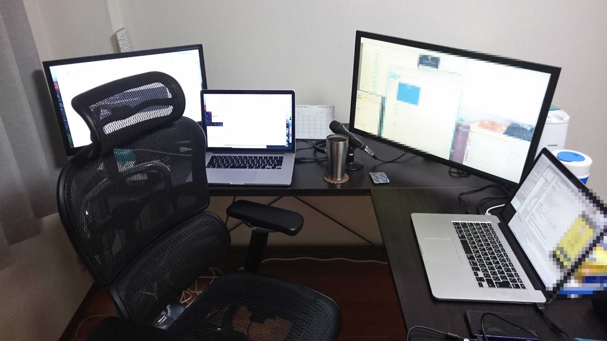

## 個人アプリをGCPからAWSに
## 移行しようとしてる話
#### 〜Terraformで作り始めてるところまで〜

株式会社モンスター・ラボ 石倉 昇

---

## 免責事項

- まだ移行完了していません。
- 使い倒した人から見ると、浅いことを言っている可能性があります。
- どこのクラウドが良い悪いではなく、適材適所だと思っています。

---

## 自己紹介
- 石倉 昇
- [株式会社モンスター・ラボ](https://monstar-lab.com/) 所属
  - 受託でアプリとかWEBサービスとか作ってる
  - オフショアもがっつりやってる
- 富山市内の自宅でリモートワーク中
- Twitter: [@noboru_i](https://twitter.com/noboru_i)
- GitHub: [noboru-i](https://github.com/noboru-i)

---

### こんな感じで仕事してます



---

### 個人で作ってるアプリ


---

## 会社紹介

<!-- .slide: data-background="img/ml_app.png" -->

---

### 店舗向けBGMサービス

<!-- .slide: data-background="img/monstar_ch.png" -->

---

### ゲーム

<!-- .slide: data-background="img/heroes.png" -->

---

## 本題

---

5年ほど前から個人的に運用しているアプリの話です。

Google Cloud Platform上で動かしていましたが、<br>
ふと思い立って別のサーバへの移行を計画しました。

---

## アジェンダ

- 移行対象アプリの紹介
- クラウドサービスの比較
- AWSで構築準備している様子の紹介
  - Terraformの紹介

---

## 移行対象のアプリ

[詰め共円](https://my-android-server.appspot.com)

<small>[https://my-android-server.appspot.com](https://my-android-server.appspot.com)</small>


---

## アプリ版


---

## そもそも、共円とは

<!-- .slide: data-background="img/goban.png" -->

- 各プレイヤーは１人１個ずつ順番に、囲碁みたいな感じでコマを盤上の格子点に置いていきます
- このとき、各プレイヤーは、「同一円周上にある４つのコマ」が発生しないように気をつけてコマを置いていかなければなりません

<small>参考： [http://nadamath2012.web.fc2.com/program/kyouen1.html](http://nadamath2012.web.fc2.com/program/kyouen1.html)</small>

<small style="position: absolute; right: 0; bottom: 0;">photo by <a href="https://www.flickr.com/photos/nachof/2453994998">Michel got his goban and stones / nachof</a></small>

---

## 詰め共円とは

複数の配置されてる石の中から、4つを選んで、<br>
それが同一円周上にあれば正解


---

## 現在のアプリ構成


プラットフォームは、<br>
Android / iOS / WEB

- Google App Engine
- Python (webapp2, jinja2)
  - APIサーバ（for iOS / Android）
  - SPAっぽい構成
- Google Cloud Datastore

---

## Google App Engineの特徴

- 大きなの無料枠
- PaaS
- Spin-upが遅い

---

### 大きな無料枠


<small>[https://cloud.google.com/appengine/?hl=ja](https://cloud.google.com/appengine/?hl=ja)</small>

---

### 実際のアクセスと料金

- Google App Engine
  - せいぜいで、秒間0.15リクエスト（だいたい0.03で収まる）
  - たまに人が来る、というレベル


---

### 実際のアクセスと料金

- Google Cloud Datastore
  - 使用容量：33MByte
  - エンティティ：3万


---

つまり

### 無料枠で収まる

---

### PaaS

- Platform as a Service
- コードを書けば、Webサービスが動く
  - インフラの管理とかしなくて良い
- デプロイも容易
  - Blue Green Deployment

---

### Spin-up問題

- ほとんど使われてないので、  
インスタンスが落ちている
  - 立ち上がるまでに時間がかかる

---

### Spin-upの対策

- HTMLの返却はSpin-up時間がかからない
- Javaに比べると、Pythonはそもそも早い
- ページの外形だけHTMLで返却後、  
Ajaxで読み込むことにしたら、体感は早い


---

全然問題ない

---

## 移行しようとした動機

- 会社でPythonを使うことが無さそう
- Ruby on Railsのアプリケーションを持っていたい
  - 会社で増えてきたので、Gemとかのテスト用に
  - GAEではPyhon/Java/PHP/Goのみサポート  
   (2016/02現在)
- 会社でGoogle Cloud Platformを使うことが無さそう
  - GAE以外での運用経験も積みたい

<small>（でも、あんまりにも面倒なことはやりたくない）</small>

---

### ついでに
- Dockerとか流行ってるし使ってみたい
- AWSのいろんなサービス使ってみたい
  - SNSとかCognitoとかLambdaとかCodeDeployとか...
- WebSocketとかやってみたい  
（Channel APIってので出来るらしいけど）

---

### しかし先月

[Google App EngineがRubyとNode.jsのサポートを発表。](http://www.publickey1.jp/blog/16/google_app_enginerubynodejsgcp_next_2016.html)

移行する意味が半分ぐらい消失orz

---

## 他のクラウドの調査

---

注：¥100/月ぐらいしか稼げてないアプリなので、<br>
最小金額にこだわっています

---

### データストア

- Amazon RDS
- Amazon ElastiCache
- Heroku Add-on
- Cloud Datastore
- Amazon DynamoDB

---

#### Amazon RDS
- t2.microで約$20/月  
（MySQLの場合。Multi-AZにしたらさらに倍。）
- 高い信頼性と拡張性
  - 簡単にスケールアップ
  - 簡単にリードレプリカを複製
- 簡単にバックアップ・リストア
- AWSの各種サービスとのセキュアな連携が可能
- MySQL, Aurora, MariaDBなど6つのエンジンから選べる

---

#### Amazon ElastiCache
- t2.microで約$20/月
- エンジンとして、Memcached / Redisから選択できる
  - Redisであれば、高い表現力。（SortedSetなど）
- 簡単にスケールアップ・スケールアウト
- 簡単にバックアップ・リストア
- AWSの各種サービスとのセキュアな連携が可能

---

#### Heroku Add-on
- 各種サービスによって無料枠が違う
- [Heroku Postgres](https://elements.heroku.com/addons/heroku-postgresql)
  - 1万行まで無料
  - $9/月で1000万行まで
- [ClearDB MySQL](https://elements.heroku.com/addons/cleardb) / [JawsDB MySQL](https://elements.heroku.com/addons/jawsdb)
  - 5MBまで無料
  - $10/月で1GB
- 他にも、RedisやNeo4jなどもあるが、どれも容量制限が厳しめ
  - とはいえ、無料でちょっと使えるので、  
  プロトタイプとかには良いかも
- Heroku上で使うのであれば、環境変数を設定してくれたりと楽

---

#### Cloud Datastore
- 無料で一定量使える
  - 1日50kの読み取り、書き込みが可能  
  https://cloud.google.com/datastore/#pricing
- 自動的にスケール
- RESTfulインターフェースでアクセス可能
- GoogleのApp EngineやCompute Engineとの高い親和性
  - App Engineでは接続情報とかを意識せずに操作出来る

---

#### Amazon DynamoDB
- 無料で一定量使える
  - 25 GBの無料ストレージ
  - 最大25の書き込み容量ユニット
  - 25の読み込み容量ユニットのスループット容量
- 低レイテンシ
- NoSQLデータベース
- AWSの各種サービスとのセキュアな連携が可能
- Lambdaと連携してイベントドリブンにも出来る

---

値段で考えると、<br>
時間単位で料金が発生しない2つが有利

- Cloud Datastore
- Amazon DynamoDB

---

### コンピューティング

- さくらのVPS
- Google Container Engine (GKE)
- Heroku
- IBM Bluemix
- AWS ElasticBeanstalk (EB)
- Amazon EC2 Container Service (ECS)

---

#### さくらのVPS
- 700円で512Mのメモリ  
参考：[料金・仕様一覧](http://vps.sakura.ad.jp/specification/)
- 初期費用が1000円かかる
  - 頻繁な追加・サイズ変更はしづらい？
- Dockerでやろうとおもうと、土台作りから必要
  - [Dockerを使って1サーバで複数Webサービスを運用するためのマイベストプラクティス - Qiita](http://qiita.com/miyasakura_/items/5cd3b05aa9c5e4f3f4be)
- 専有サーバのようにリソースが確保されているので安心

---

#### Google Container Engine (GKE)
- 5ノードまで無料
  - Compute Engineの料金がかかる  
  最安で$4/月ぐらい（でも、sharedだから弱いかも？）
  - スタンダード マシンなら、$25.55/月  
  参考：[Google Cloud Platform 料金計算ツール](https://cloud.google.com/products/calculator/?hl=ja)
- ほぼデファクトなコンテナ管理ツール：Kubernetesを使える
- プライベートな Container Registry が付いてる
  - ストレージとデータ送信の料金のみ
- コンテナ技術を使い倒してきたGoogleのサービス

---

#### Heroku
- $7/月
- Rubyを始め、複数の言語をサポート
- Dockerもサポート（制限あり）
- 様々なAdd-onで、RDBやRedis、Monitoringなどを簡単に追加できる

---

#### IBM Bluemix
- "Instant Runtimes" はいわいるPaaS
  - Javaやphpなど複数の言語をサポート
- "Containers" はDockerの実行環境
- 512Mメモリのインスタンスが無料で利用できる
  - 128Mメモリ x 4、という使い方も出来る

---

#### AWS ElasticBeanstalk (EB)
- ELB + EC2構成が簡単に構築できる
- PaaSに近く、デプロイなども手軽に出来る
- JavaやPHPなど、Herokuと同程度の言語サポート
- Dockerもサポート
- IAMを使って、AWSの各種サービスとの連携が容易

---

#### Amazon EC2 Container Service (ECS)
- Dockerの運用に特化
- EC2インスタンスをクラスタ化
- ELBやデプロイは自分でなんとかしないといけない

---

- やっぱりDocker使ってみたい
- 会社で使ってるAWSの経験値を上げたい

↓

EBかECS

↓

なんとなくECS

---

## AWSに移行した場合の構成


- ECS
- DynamoDB
- S3
- Route 53
- ELB

---

現在の進捗

---

## Terraformで基礎工事

---

### Terraformとは

https://www.terraform.io

- HashiCorpのインフラ構築用のツール
- CloudFormationのように、コードでAWSリソースを記述出来る
- AWS以外にも、AzureやGoogle Cloudも操作できる  
[Providers](https://www.terraform.io/docs/providers/index.html) に一覧があります

---

### コードで記述する利点

- バージョン管理出来る
  - [Terraform + GitHub + CircleCI + Atlasを利用してAWSの操作を自動化した - Glide Note](http://blog.glidenote.com/blog/2015/02/18/terraform-github-circleci-atlas-aws/)
- 作ったものを綺麗さっぱり削除できる
- Management Consoleのスクショで手順を説明しなくていい

---

### CloudFormationとの違い

- 実行前にplanを確認できる
- グラフ化出来る

---

`terraform graph` でdot形式で出力

```
digraph {
	compound = "true"
	newrank = "true"
	subgraph "root" {
		"[root] aws_ecs_cluster.kyouen-cluster" [label = "aws_ecs_cluster.kyouen-cluster", shape = "box"]
		"[root] aws_ecs_service.kyouen-service" [label = "aws_ecs_service.kyouen-service", shape = "box"]
		"[root] aws_ecs_task_definition.kyouen-registry" [label = "aws_ecs_task_definition.kyouen-registry", shape = "box"]
		"[root] aws_elb.kyouen-elb" [label = "aws_elb.kyouen-elb", shape = "box"]
		"[root] aws_iam_instance_profile.ec2_profile" [label = "aws_iam_instance_profile.ec2_profile", shape = "box"]
		"[root] aws_iam_role.ec2_role" [label = "aws_iam_role.ec2_role", shape = "box"]
		"[root] aws_iam_role.ecs_role" [label = "aws_iam_role.ecs_role", shape = "box"]
		"[root] aws_iam_role_policy.AmazonEC2ContainerServiceRole" [label = "aws_iam_role_policy.AmazonEC2ContainerServiceRole", shape = "box"]
		"[root] aws_iam_role_policy.AmazonEC2ContainerServiceforEC2Role" [label = "aws_iam_role_policy.AmazonEC2ContainerServiceforEC2Role", shape = "box"]
		"[root] aws_instance.ecs-instance" [label = "aws_instance.ecs-instance", shape = "box"]
		"[root] aws_internet_gateway.kyouen-gw" [label = "aws_internet_gateway.kyouen-gw", shape = "box"]
		"[root] aws_route53_record.web" [label = "aws_route53_record.web", shape = "box"]
		"[root] aws_route53_record.www" [label = "aws_route53_record.www", shape = "box"]
		"[root] aws_route53_zone.kyouen-net" [label = "aws_route53_zone.kyouen-net", shape = "box"]
		"[root] aws_route_table.kyouen-vpc-public-rt" [label = "aws_route_table.kyouen-vpc-public-rt", shape = "box"]
		"[root] aws_route_table_association.kyouen-vpc-rta" [label = "aws_route_table_association.kyouen-vpc-rta", shape = "box"]
		"[root] aws_s3_bucket.main" [label = "aws_s3_bucket.main", shape = "box"]
		"[root] aws_security_group.allow_all" [label = "aws_security_group.allow_all", shape = "box"]
		"[root] aws_subnet.kyouen-subnet" [label = "aws_subnet.kyouen-subnet", shape = "box"]
		"[root] aws_vpc.kyouen-vpc" [label = "aws_vpc.kyouen-vpc", shape = "box"]
		"[root] provider.aws" [label = "provider.aws", shape = "diamond"]
		"[root] aws_ecs_cluster.kyouen-cluster" -> "[root] provider.aws"
		"[root] aws_ecs_service.kyouen-service" -> "[root] aws_ecs_cluster.kyouen-cluster"
		"[root] aws_ecs_service.kyouen-service" -> "[root] aws_ecs_task_definition.kyouen-registry"
		"[root] aws_ecs_service.kyouen-service" -> "[root] aws_elb.kyouen-elb"
		"[root] aws_ecs_service.kyouen-service" -> "[root] aws_iam_role.ecs_role"
		"[root] aws_ecs_service.kyouen-service" -> "[root] aws_iam_role_policy.AmazonEC2ContainerServiceRole"
		"[root] aws_ecs_service.kyouen-service" -> "[root] provider.aws"
		"[root] aws_ecs_task_definition.kyouen-registry" -> "[root] provider.aws"
		"[root] aws_elb.kyouen-elb" -> "[root] aws_instance.ecs-instance"
		"[root] aws_elb.kyouen-elb" -> "[root] aws_security_group.allow_all"
		"[root] aws_elb.kyouen-elb" -> "[root] aws_subnet.kyouen-subnet"
		"[root] aws_elb.kyouen-elb" -> "[root] provider.aws"
		"[root] aws_iam_instance_profile.ec2_profile" -> "[root] aws_iam_role.ec2_role"
		"[root] aws_iam_instance_profile.ec2_profile" -> "[root] provider.aws"
		"[root] aws_iam_role.ec2_role" -> "[root] provider.aws"
		"[root] aws_iam_role.ecs_role" -> "[root] provider.aws"
		"[root] aws_iam_role_policy.AmazonEC2ContainerServiceRole" -> "[root] aws_iam_role.ecs_role"
		"[root] aws_iam_role_policy.AmazonEC2ContainerServiceRole" -> "[root] provider.aws"
		"[root] aws_iam_role_policy.AmazonEC2ContainerServiceforEC2Role" -> "[root] aws_iam_role.ec2_role"
		"[root] aws_iam_role_policy.AmazonEC2ContainerServiceforEC2Role" -> "[root] provider.aws"
		"[root] aws_instance.ecs-instance" -> "[root] aws_security_group.allow_all"
		"[root] aws_instance.ecs-instance" -> "[root] aws_subnet.kyouen-subnet"
		"[root] aws_instance.ecs-instance" -> "[root] provider.aws"
		"[root] aws_internet_gateway.kyouen-gw" -> "[root] aws_vpc.kyouen-vpc"
		"[root] aws_internet_gateway.kyouen-gw" -> "[root] provider.aws"
		"[root] aws_route53_record.web" -> "[root] aws_elb.kyouen-elb"
		"[root] aws_route53_record.web" -> "[root] aws_route53_zone.kyouen-net"
		"[root] aws_route53_record.web" -> "[root] provider.aws"
		"[root] aws_route53_record.www" -> "[root] aws_route53_zone.kyouen-net"
		"[root] aws_route53_record.www" -> "[root] aws_s3_bucket.main"
		"[root] aws_route53_record.www" -> "[root] provider.aws"
		"[root] aws_route53_zone.kyouen-net" -> "[root] provider.aws"
		"[root] aws_route_table.kyouen-vpc-public-rt" -> "[root] aws_internet_gateway.kyouen-gw"
		"[root] aws_route_table.kyouen-vpc-public-rt" -> "[root] aws_vpc.kyouen-vpc"
		"[root] aws_route_table.kyouen-vpc-public-rt" -> "[root] provider.aws"
		"[root] aws_route_table_association.kyouen-vpc-rta" -> "[root] aws_route_table.kyouen-vpc-public-rt"
		"[root] aws_route_table_association.kyouen-vpc-rta" -> "[root] aws_subnet.kyouen-subnet"
		"[root] aws_route_table_association.kyouen-vpc-rta" -> "[root] provider.aws"
		"[root] aws_s3_bucket.main" -> "[root] provider.aws"
		"[root] aws_security_group.allow_all" -> "[root] aws_vpc.kyouen-vpc"
		"[root] aws_security_group.allow_all" -> "[root] provider.aws"
		"[root] aws_subnet.kyouen-subnet" -> "[root] aws_vpc.kyouen-vpc"
		"[root] aws_subnet.kyouen-subnet" -> "[root] provider.aws"
		"[root] aws_vpc.kyouen-vpc" -> "[root] provider.aws"
	}
}
```

---

graphviz で画像出力するとこんな感じです。


---

### 導入方法

Macの場合、Homebrewで一発

```
brew install terraform
```

<small>
WindowsやLinux用のバイナリもあります。 [Installing Terraform](https://www.terraform.io/intro/getting-started/install.html)
</small>

---

### Terraformの基本的な使い方

- 実行計画を確認
```sh
terraform plan
```

- 反映する
```sh
terraform apply
```

- 削除する
```sh
terraform destroy
```

---

### Terraformの基本的な使い方

カレントディレクトリの*.tfを実行してくれる

```ruby
resource "リソースの種類" "任意の名前" {
  属性 = "値"
}
```

リソースの一覧
[Provider: AWS](https://www.terraform.io/docs/providers/aws/index.html)

---

### 例：Route 53

```ruby
resource "aws_route53_zone" "kyouen-net" {
  name = "xn--b6qvb.net"
}

resource "aws_route53_record" "www" {
  zone_id = "${aws_route53_zone.kyouen-net.zone_id}"
  name = "www.xn--b6qvb.net"
  type = "A"

  alias {
    name = "${aws_s3_bucket.main.website_domain}"
    zone_id = "${aws_s3_bucket.main.hosted_zone_id}"
    evaluate_target_health = true
  }
}

resource "aws_route53_record" "web" {
  zone_id = "${aws_route53_zone.kyouen-net.zone_id}"
  name = "web.xn--b6qvb.net"
  type = "A"

  alias {
    name = "${aws_elb.kyouen-elb.dns_name}"
    zone_id = "${aws_elb.kyouen-elb.zone_id}"
    evaluate_target_health = true
  }
}
```

---

### 例：S3

```ruby
resource "aws_s3_bucket" "main" {
    bucket = "www.xn--b6qvb.net"
    acl = "public-read"
    policy = "${file("aws_s3_bucket-policy/main.json")}"

    website {
        index_document = "index.html"
        error_document = "error.html"
    }
}
```

---

#### 例：S3 (aws_s3_bucket-policy/main.json)

```json
{
  "Version": "2012-10-17",
  "Statement": [
    {
      "Sid": "PublicReadForGetBucketObjects",
      "Effect": "Allow",
      "Principal": "*",
      "Action": "s3:GetObject",
      "Resource": "arn:aws:s3:::www.xn--b6qvb.net/*"
    }
  ]
}
```
---

### 例：EC2とELB

```ruby
resource "aws_instance" "ecs-instance" {
    ami = "ami-b3afa2dd"
    instance_type = "t2.micro"
    key_name = "aws_key"
    security_groups = ["${aws_security_group.allow_all.id}"]
    monitoring = true
    subnet_id = "${aws_subnet.kyouen-subnet.id}"
    associate_public_ip_address = true
    user_data = "${file("aws_instance-user_data/userdata.sh")}"
    iam_instance_profile = "ec2_profile"
}

resource "aws_elb" "kyouen-elb" {
  name = "kyouen-elb"
  subnets = ["${aws_subnet.kyouen-subnet.id}"]
  security_groups = ["${aws_security_group.allow_all.id}"]

  listener {
    instance_port = 3000
    instance_protocol = "http"
    lb_port = 80
    lb_protocol = "http"
  }

  health_check {
    healthy_threshold = 2
    unhealthy_threshold = 2
    timeout = 3
    target = "HTTP:3000/"
    interval = 30
  }

  instances = ["${aws_instance.ecs-instance.id}"]
  cross_zone_load_balancing = true
  idle_timeout = 400
  connection_draining = true
  connection_draining_timeout = 400
}
```

---

### 例：ECS

```ruby
resource "aws_ecs_cluster" "kyouen-cluster" {
  name = "kyouen-cluster"
}

resource "aws_ecs_task_definition" "kyouen-registry" {
  family = "kyouen-registry"
  container_definitions = "${file("aws_ecs_task_definition-container_definitions/kyouen.json")}"
}

resource "aws_ecs_service" "kyouen-service" {
  name = "kyouen-service"
  cluster = "${aws_ecs_cluster.kyouen-cluster.id}"
  task_definition = "${aws_ecs_task_definition.kyouen-registry.arn}"
  desired_count = 1
  iam_role = "${aws_iam_role.ecs_role.arn}"
  deployment_maximum_percent = 100
  deployment_minimum_healthy_percent = 0
  depends_on = ["aws_iam_role_policy.AmazonEC2ContainerServiceRole"]

  load_balancer {
    elb_name = "${aws_elb.kyouen-elb.id}"
    container_name = "kyouen"
    container_port = 3000
  }
}
```

---

### デモ

- 実行
```sh
terraform plan
terraform apply
```

- 作成されたリソースの確認

- 削除
```sh
terraform destroy
```

---

### やってみてわかった

t2.micro一台では、無停止デプロイが出来ない

詳細は[Amazon ECS に途中で挫折しないために | ORIH](http://orih.io/2015/12/a-few-things-i-wanted-to-know-before-playing-with-amazon-ecs/)

---

### ElasticBeanstalk Dockerで良いのでは？

- お手軽に始めるのであれば、圧倒的にElasticBeanstalkが楽
  - Service とか Taskとかの概念を学ばなくてもいい
  - デプロイとかもいい感じにやってくれるっぽい
- 複数のEC2インスタンス x 複数種類のDocker containerとかになると、ECSの柔軟性が必要？

[AWSのDockerデプロイサービスを比較する ｜ Developers.IO](http://dev.classmethod.jp/cloud/aws-docker-service-catalog/)

小規模だと、ECS辛そうなので、EBに変えようと模索中

---

## 結論

個人でお手軽にサービスを公開するには、PaaSが最高<br>
<small>GAEとかBluemixとかまじ安い</small>

AWSの各種サービスと繋げるなら、<br>
やっぱりAWS上のインフラ<br>
<small>LambdaとかIoTとか使ってみたいのがいろいろ</small>

Terraformは便利<br>
<small>Management Consoleでぽちぽちやるのに疲れた</small>

---

## 結論 その２

個人でWEBサービスを持っていると、<br>
いろいろ遊べるのでおすすめ

ユーザ数が大きくなると<br>
身動き取りづらくなりそうなので、<br>
少人数がそれなりに使ってくれるサービスが理想（？）

---

## ありがとうございました。
