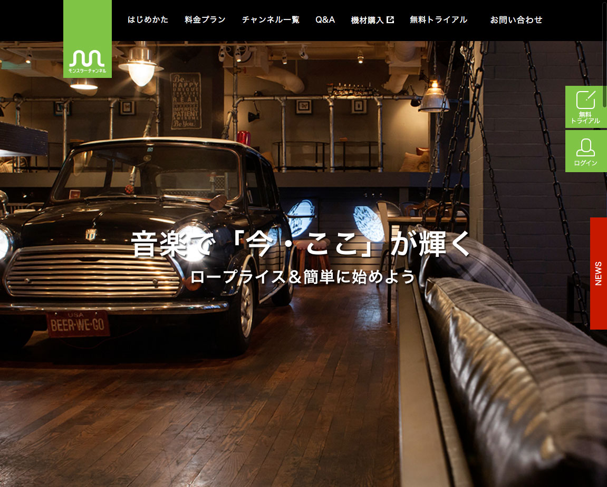
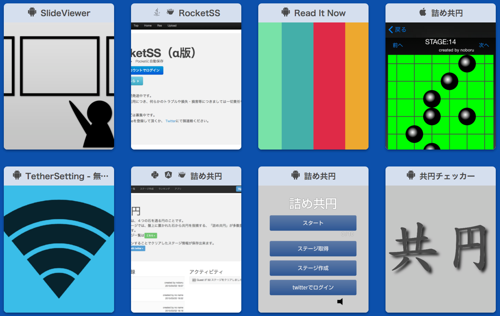

# メンターLT会

---

### who are you

- 石倉 昇
- 1988年生まれ
- 所属：株式会社モンスター・ラボ
  - サービス開発事業部 テクノロジスト
- 勤務地：富山県自宅
- 得意領域：Android（？）

---

### モンスター・ラボ

- グローバルソーシング事業
  - 受託型
  - 仲介型
- コンテンツ事業
  - 自社サービス（音楽・ゲーム・トラベル）
  - 共同サービス

---

### 受託の開発実績

<small>[http://monstar-lab.com/services/app/](http://monstar-lab.com/services/app/)</small>

---

### 店舗向けBGMサービス

<small>[http://monstar.ch/](http://monstar.ch/)</small>

---

### 略歴

- 2008年〜  
富山の中小SIerに入社

- 2012年〜  
株式会社モンスター・ラボに転職  
受託でアプリ・WEBの開発

- 2015年〜  
富山でリモートワーク開始  
プロジェクト横断の自動化や、  
オフショア拠点のレビューなど。

---

### 個人活動

<small>[http://noboru-i.github.io/](http://noboru-i.github.io/)</small>

---

## 今日話すこと

- メタタリングにあたって
  - どんなことが得意か
  - どんな人に来てほしいか
  - メンタリング方法
- 得意な領域、言語
- 苦手な領域、言語
- メンバーへ一言

---

### どんなことが得意か

- コードレビュー
- 自動化
- リモートワーク

---

### どんな人に来てほしいか

- 技術にもこだわりたい方
- しっかりとコードレビューを受けたい方

---

### メンタリング方法

居住地が富山なので、対面でのやりとりは難しいです。

Slackなどのチャットツールを中心に、必要に応じてzoom.usやappear.inを使ったビデオ通話ができればと思います。

コードなどについては、GitHubにあげていただけると助かります。

---

### 得意な領域、言語

AndroidのJavaが一番得意ではありますが、  
経験上いろいろやってきたので、  
それ以外も広く浅く出来るとは思います。

---

経歴的には

- 日本語をJavaに翻訳（前職）
- PHPでサーバサイド
- Android/iOSでWEBとの  
ハイブリッドアプリ開発
- エンジニア自分1人のWEBアプリ開発
- iOSアプリのプロジェクトマネージャー
- ゲームのサーバサイドをRailsで開発
- 超短納期のAndroidアプリ開発
- プロジェクト横断の自動化促進
- オフショア開発チームのコードレビュー

---

### 苦手な領域、言語

個人制作物を見てもらえればわかるかと思いますが、ビジュアル面は弱いです。

---

### メンバーへ一言

地方に住んでいるため、  
対面で会う機会は無いかもしれません。

その分、Slackなどのツールで  
十分に連絡とりながら進めていきたいと思います。

必要であれば、zoom.usやappear.inなどで会話も出来ます。

---

### ありがとうございました。
