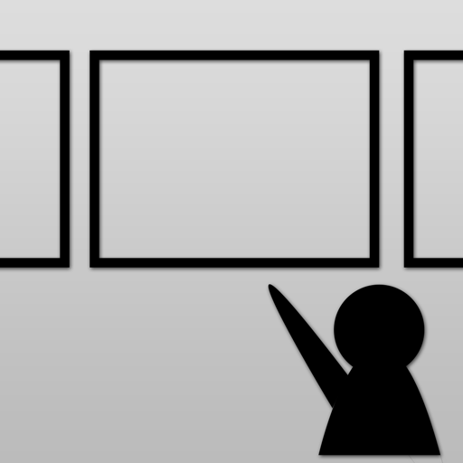

# How to use [SlideViewer](https://play.google.com/store/apps/details?id=hm.orz.chaos114.android.slideviewer)

---

Please download!

https://play.google.com/store/apps/details?id=hm.orz.chaos114.android.slideviewer

---

After install this app,

When you open slideshare's url...

---

<!-- .slide: data-background-image="img/open_link.png" data-background-size="300px" -->

empty <!-- .element: style="color: transparent;" -->
---

<!-- .slide: data-background-image="img/slide_screen.png" data-background-size="300px" -->

empty <!-- .element: style="color: transparent;" -->
---

After tap back key,

You can see history of slide list.

---

<!-- .slide: data-background-image="img/slide_list.png" data-background-size="300px" -->

empty <!-- .element: style="color: transparent;" -->

---

## Other feature

---

## OCR support

---

<!-- .slide: data-background-image="img/ocr_steps/1.png" data-background-size="300px" -->

empty <!-- .element: style="color: transparent;" -->

---

<!-- .slide: data-background-image="img/ocr_steps/2.png" data-background-size="300px" -->

empty <!-- .element: style="color: transparent;" -->

---

<!-- .slide: data-background-image="img/ocr_steps/3.png" data-background-size="300px" -->

empty <!-- .element: style="color: transparent;" -->

---

<!-- .slide: data-background-image="img/ocr_steps/4.png" data-background-size="300px" -->

empty <!-- .element: style="color: transparent;" -->

---

<!-- .slide: data-background-image="img/ocr_steps/5.png" data-background-size="300px" -->

empty <!-- .element: style="color: transparent;" -->

---

<!-- .slide: data-background-image="img/ocr_steps/6.png" data-background-size="300px" -->

empty <!-- .element: style="color: transparent;" -->

---

<!-- .slide: data-background-image="img/ocr_steps/7.png" data-background-size="300px" -->

empty <!-- .element: style="color: transparent;" -->
