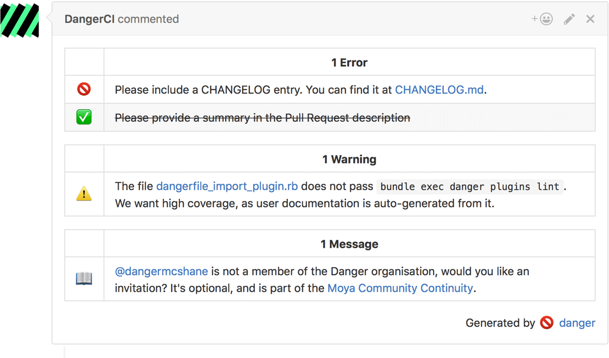
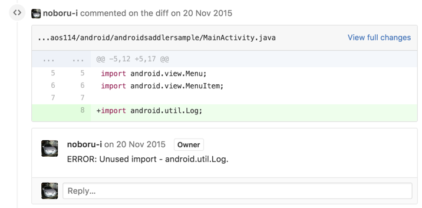
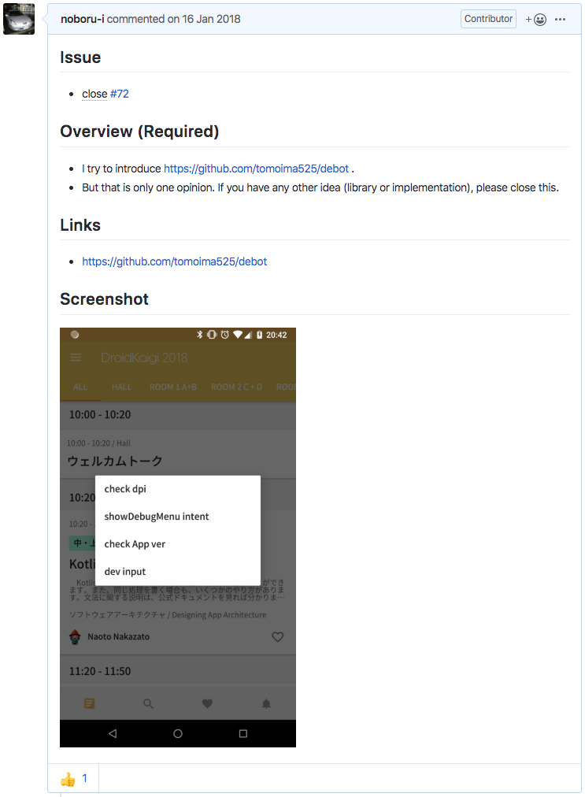

<style>
h1 {
  display: flex;
  justify-content: center;
  align-items: center;
  height: 100%;
}
img {
  width: 95%;
}
</style>
<style scoped>
h4 {
  font-size: 1.5rem;
  text-align: right;
  margin-top: -120px;
}
</style>

# スマホアプリ開発を支えるRuby

#### Burikaigi2020 <br> 株式会社 モンスター・ラボ <br> 石倉 昇

---

## Agenda

- 自己紹介
- fastlane紹介
- fastlane + ruby
- Danger紹介
- Danger + ruby
- まとめ

---

## 自己紹介

- 名前 : 石倉 昇 (Twitter: @noboru_i)
- 出身地 : 富山県富山市
- 所在地 : 富山県富山市
- 所属 : 株式会社 モンスター・ラボ
- 勤務形態 : フルリモートワーク
- 興味範囲 : Android / Flutter / iOS / CI/CD / Rails / AWS / React / Nuxt.js / Laravel

---

## 株式会社 モンスター・ラボ

- 本社は恵比寿
- Web系の受託開発がメイン
- 音楽配信事業やゲーム開発もやってる
- 15ヵ国・26都市に拠点がある
- 恵比寿の本社内にも、外国籍メンバーが多数

---

# 本題

---

## 本題

RubyといえばRuby on Rails

ですが、
それ以外の場所でもRubyの便利さ・楽しさが活用されています

今回は、スマホアプリ周辺での2つの活用事例を紹介します

---

## 想定ターゲット

- Ruby on Railsが出来て、さらに活躍の幅を広げたい人
- スマホアプリのビルドに困っている人
  - 手作業が多い
  - Aさんしかビルドできない（属人性）
- コードレビューに困っている人
  - 細かな指摘が多いとか
  - 定形チェックの漏れ

---

# 事例1 : fastlane

---

## iOSのビルドやデプロイって辛くない？

1. ipaを作るのが面倒
    - XcodeのGUIで行う
    - `xcodebuild`コマンドに大量の引数を与える

2. テスターに確認してもらうために何度もデプロイ
    - 細かな修正の度に手動でデプロイ
    - 特定の人しかデプロイ作業ができない

---

## それを解決するためにfastlane

例：アプリをビルドして、Testflightへ配信

```ruby
# イメージ
lane :beta do
  build_app
  upload_to_testflight
end
```

を `Fastfile` に書いて、 `fastlane beta` を実行するだけ

---

`build_app` や `upload_to_testflight` などを"アクション"と呼びます

他にも、いろいろなアクションが標準で用意されています

（独自アクションも作れます）

---

<style scoped>
p {
  margin-top: -3em;
  margin-left: -3em;
  margin-right: -3em;
  font-size: 1.1rem;
}
</style>

adb / adb_devices / add_extra_platforms / add_git_tag / app_store_build_number / appaloosa / appetize / appetize_viewing_url_generator / appium / appledoc / appstore / apteligent / artifactory / automatic_code_signing / backup_file / backup_xcarchive / build_and_upload_to_appetize / build_android_app / `build_app` / build_ios_app / bundle_install / capture_android_screenshots / capture_ios_screenshots / capture_screenshots / carthage / cert / changelog_from_git_commits / chatwork / check_app_store_metadata / clean_build_artifacts / clean_cocoapods_cache / clear_derived_data / clipboard / cloc / cocoapods / commit_github_file / commit_version_bump / copy_artifacts / crashlytics / create_app_on_managed_play_store / create_app_online / create_keychain / create_pull_request / danger / debug / default_platform / delete_keychain / `deliver` / deploygate / dotgpg_environment / download / download_dsyms / download_from_play_store / dsym_zip / echo / ensure_bundle_exec / ensure_env_vars / ensure_git_branch / ensure_git_status_clean / ensure_no_debug_code / ensure_xcode_version / environment_variable / erb / fastlane_version / flock / frame_screenshots / frameit / gcovr / get_build_number / get_build_number_repository / get_certificates / get_github_release / get_info_plist_value / get_ipa_info_plist_value / get_managed_play_store_publishing_rights / get_provisioning_profile / get_push_certificate / get_version_number / git_add / git_branch / git_commit / git_pull / git_submodule_update / git_tag_exists / github_api / google_play_track_version_codes / gradle / gym / hg_add_tag / hg_commit_version_bump / hg_ensure_clean_status / hg_push / hipchat / ifttt / import / import_certificate / import_from_git / increment_build_number / increment_version_number / install_on_device / install_provisioning_profile / install_xcode_plugin / installr / is_ci / jazzy / jira / lane_context / last_git_commit / last_git_tag / latest_testflight_build_number / lcov / mailgun / make_changelog_from_jenkins / `match` / min_fastlane_version / modify_services / nexus_upload / notification / number_of_commits / oclint / onesignal / opt_out_usage / pem / `pilot` / pod_lib_lint / pod_push / podio_item / precheck / println / produce / prompt / push_git_tags / push_to_git_remote / puts / read_podspec / recreate_schemes / register_device / register_devices / reset_git_repo / reset_simulator_contents / resign / restore_file / rocket / rsync / ruby_version / run_tests / say / `scan` / scp / screengrab / set_build_number_repository / set_changelog / set_github_release / set_info_plist_value / set_pod_key / setup_ci / setup_circle_ci / setup_jenkins / setup_travis / sh / `sigh` / skip_docs / slack / slather / `snapshot` / sonar / spaceship_logs / splunkmint / spm / ssh / `supply` / swiftlint / sync_code_signing / team_id / team_name / testfairy / testflight / tryouts / twitter / typetalk / unlock_keychain / update_app_group_identifiers / update_app_identifier / update_fastlane / update_icloud_container_identifiers / update_info_plist / update_keychain_access_groups / update_plist / update_project_provisioning / update_project_team / update_urban_airship_configuration / update_url_schemes / upload_symbols_to_crashlytics / upload_to_app_store / upload_to_play_store / upload_to_play_store_internal_app_sharing / upload_to_testflight / validate_play_store_json_key / verify_build / verify_pod_keys / verify_xcode / version_bump_podspec / version_get_podspec / xcarchive / xcbuild / xcclean / xcexport / xcode_install / xcode_select / xcode_server_get_assets / xcodebuild / xcov / xctest / xctool / xcversion / zip

---

## fastlaneのアクションの中身

ただのRubyのclass

```ruby
# 例 : build_ios_app
module Fastlane
  module Actions
    module SharedValues
      IPA_OUTPUT_PATH ||= :IPA_OUTPUT_PATH
      DSYM_OUTPUT_PATH ||= :DSYM_OUTPUT_PATH
      XCODEBUILD_ARCHIVE ||= :XCODEBUILD_ARCHIVE # originally defined in XcodebuildAction
    end

    class BuildIosAppAction < Action
      def self.run(values)
        require 'gym'

        unless Actions.lane_context[SharedValues::SIGH_PROFILE_TYPE].to_s == "development"
          values[:export_method] ||= Actions.lane_context[SharedValues::SIGH_PROFILE_TYPE]
        end
```

---

つまり

# Rubyができれば<br>独自アクションが作れる

---

## ビルドスクリプト (Fastfile)

Fastfile自体もRubyで記述します

事例を3つほど紹介します

---

### 1. ビルドブランチ名で、Schemeを変えてipaを作成

```ruby
lane :build do
  branch_name = ENV['CIRCLE_BRANCH']
  my_scheme = case branch_name
              when "master"
                "sampleRelease"
              when /release-\d/
                "sampleStg"
              else
                "sampleDev"
              end
  build_app(
    scheme: my_scheme
  )
end
```

---

### 2. tag名から、出力ipaの名前を生成

```ruby
private_lane :get_output_name do |options|
  version = get_info_plist_value(path: "./Info.plist", key: "CFBundleShortVersionString")
  date = Date.today.strftime("%Y-%m-%d")
  options[:prefix] + "_" + version + "_" + date
end

lane :build do |options|
  build_app(output_name: get_output_name(options))
end
```

---

### 3. 複数のplistのバージョンを一括で変更

```ruby
%w{free premium}.each do |scheme|
  set_info_plist_value(
    path: "./" + scheme + ".plist",
    key: "CFBundleShortVersionString",
    value: option[:new_version]
  )
end
```

---

つまり

# Rubyができれば、<br>プロジェクトに合わせた<br>ビルドスクリプトが書ける

---

# 事例2 : Danger

---

## コードレビュー辛くない？

- インデントがずれてる
- 変数名にsnake_caseとcamelCaseが混在してる
- Pull RequestのDescriptionが足りない

こんなレビューばかりだと↓

- 細かな指摘ばかりとなり、ギスギスしやすい
- やりとりに時間がかかる
- 本質的なレビューができない

---

## Danger

https://danger.systems/ruby/

> Stop saying "you forgot to …" in code review.
> Formalize your Pull Request etiquette.

機械的にできるコードレビューは、機械にやらせる

---

## もうちょっと具体的なDangerの使い方

- GitHub の Pull Request 作成を検知
- CIサービス（CircleCI など）上で利用する
- ktlint や SwiftLint などを実行する
- Pull Requestにコメントをつける

---

GitHub上の表示例 (1/2)



---

GitHub上の表示例 (2/2)



---

## Dangerの設定方法

`Dangerfile` というファイルに、Ruby (DSL) を書く

使えるメソッド例

- `message("You have added 3 more gems to the app.")`
- `warn("You have not included a CHANGELOG entry.")`
- `fail("Our linter has failed.")`
- `markdown("## ")`
- `warn("Please add your name", file: "CHANGELOG.md", line: 4)`

---

実際、`warn` などを直接利用せず、
用意されている Plugin を利用することが多いです

---
<style scoped>
p {
  margin-left: -1em;
  margin-right: -1em;
  font-size: 1.5rem;
}
</style>

## Dnager Plugins

https://danger.systems/ruby/

prose / angular_commit_lint / `android_lint` / apkanalyzer / apkstats / android_permissions_checker / auto_label / changelog / clubhouse / `checkstyle_format` / clorox / cobertura / code_coverage / commit_lint / conflict_checker / duplicate_localizable_strings / eslint / findbugs / `flutter_lint` / hlint / homete / jazzy / jenkins / `ktlint` / `kotlin_detekt` / jira / jira_sync / junit / lgtm / linear_history / lock_dependency_versions / mention / missed_localizable_strings / pep8 / pivotal_tracker / pronto / rails_best_practices / reek / resharper_inspectcode / rubocop / shiphawk-plugin / shellcheck / simplecov_json / slack / slather / slim_lint / synx / suggester / `swiftlint` / tailor / textlint / the_coding_love / toc / todoist / transifex / podliblint / puppet_lint / package_json_lockdown / php_codesniffer / warnings_next_generation / welcome_message / xcode_summary / xcodebuild / xcov

---

## Plugin は Ruby gem

例： danger-checkstyle_format gem

```ruby
module Danger
  class DangerCheckstyleFormat < Plugin
    attr_accessor :base_path

    def report(file, inline_mode = true)
      # ...
```

利用方法

```ruby
checkstyle_format.base_path = Dir.pwd
checkstyle_format.report 'app/build/reports/checkstyle/checkstyle.xml'
```

---

つまり

# Rubyができれば、<br>独自のチェックルールが作れる

---

## Dangerfile

Dangerfile自体もRubyで記述します

事例を3つほど紹介します

---

## 1. xmlが変わっていたら、スクリーンショットを求める

Android で layout の XML が変わっていた場合、
Pull Request の説明文にキャプチャが欲しいです。

---



イメージ

---

Ruby でそのまま書けます

```ruby
# Dangerfile

if git.modified_files.include? "app/src/main/res/layout/*.xml"
    && !(github.pr_body.include?("![]") || github.pr_body.include?("プロジェクト毎のルール作成や<br>自動化ができる

---

## まとめ

- Rubyが書ければ、開発環境を良くできる
    - fastlane でアプリのビルド・デプロイを自動化できる
    - Danger でレビュー周りを自動化できる

---

## ちなみに

- fastlane は、Swift 版が beta リリース済み
- Danger は、 JavaScript 版と Swift 版がリリース済み
