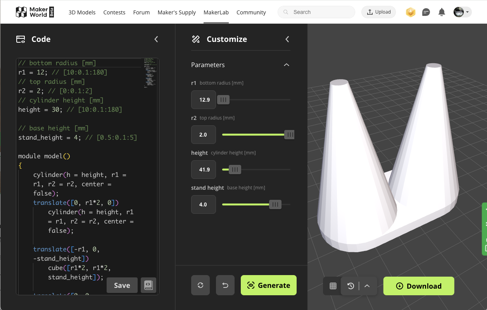

# OpenSCAD<br>はじめました

北陸三県.rb Lightning Talks in Kanazawa

<div class="absolute right-30px bottom-30px">
@noboru-i
</div>

---

# 自己紹介

- 名前: 石倉 昇
- 所属: 株式会社モンスターラボ
- 仕事: 受託でスマホアプリ作成
- 技術: Flutterがメイン
- 3Dプリンター歴、OpenSCAD歴は浅いのでご容赦ください

---
layout: image-right

image: ./images/a1mini.jpg
---
去年の10月末に3Dプリンターが届いて、3ヶ月ほど経過しました。

- Bambu Lab A1 mini Combo
- 多色印刷可能
- 180mm四方の造形可能
- 多色印刷ナシなら[3万円ちょっと](https://jp.store.bambulab.com/products/a1-mini?skr=yes)で買えます

---
layout: image-right

image: ./images/from_makerworld.jpg
---
MakerWorldで共有されているデータを印刷したりしてます。

---
layout: two-cols
---

独自の形状を作りたいものは、 **OpenSCAD** という言語？を利用して設計したりもしてます。<br>
（とはいえ、長方形と円錐＋アルファの組み合わせ）

今日は、この **OpenSCAD** を紹介します。

イメージ→

::right::

```js
// outside x [mm]
width = 20;  // [10:0.1:180]
// outside y [mm]
length = 20; // [10:0.1:180]
// outside z [mm]
height = 10; // [10:0.1:180]
// wall thickness [mm]
wall = 1; // [0.5:0.1:5]
module model()
{
  difference() {
    cube([width, length, height]);
    translate([wall, wall, wall])
      cube([width - wall * 2, length - wall * 2, height - wall]);
  }
}
model();
```

---
layout: image-right

image: ./images/code_stl_mono.drawio.svg
---
"コードで管理" することの利点は、日常的に経験してると思います。

- 変更が容易
- 差分が確認しやすい
- GitHubを利用したコード共有

これを、"モノ"に適用できます

---
layout: image-right

image: ./images/created.drawio.png
---
OpenSCADで作ったものをいくつか紹介

- カレンダー置き
- 箱 (ミリ単位で調整可)
- タブレット・PC置き
- 指輪置き

---
layout: image-right

image: ./images/develop_desktop.png
---

## どうやってコードを書いているか

VS Code + Preview用アプリ

Hot reload的に、すぐに確認できる

<small>ただ自分の環境だと、くり抜いたところがうまく表示されない。。。</small>

---
layout: image-right

image: ./images/double_ring_1.drawio.png
---

## 具体例：<br>double ring stand の作り方

奥さんに「指輪2つ置ける、スタンドみたいなの作ってよ」と言われて作ったもの

---
layout: image-right

image: ./images/double_ring_2.drawio.png
---

変数宣言

```js
// bottom radius [mm]
r1 = 12; // [10:0.1:180]
// top radius [mm]
r2 = 2; // [0:0.1:2]
// cylinder height [mm]
height = 30; // [10:0.1:180]

// base height [mm]
stand_height = 4; // [0.5:0.1:5]
```

---
layout: image-right

image: ./images/double_ring_3.drawio.png
---

円錐を描画

```js
module model()
{
  cylinder(
    h = height,
    r1 = r1,
    r2 = r2,
    center = false
  );
}
model();
```

---
layout: image-right

image: ./images/double_ring_4.drawio.png
---

円錐２を描画

```js
module model()
{
  cylinder(...);

  // さっきのcylinderと同じものを、
  // Y軸方向にズラして配置
  translate([0, r1*2, 0])
    cylinder(
      h = height,
      r1 = r1,
      r2 = r2
    );
}
model();
```

---
layout: image-right

image: ./images/double_ring_5.drawio.png
---

土台を追加

```js
module model()
{
  // 円錐2つは省略

  // 円錐の下に、薄い円柱を追加
  translate([0, 0, -stand_height])
    cylinder(
      h = stand_height,
      r = r1
    );
  translate([0, r1*2, -stand_height])
    cylinder(
      h = stand_height,
      r = r1
    );
}
model();
```

---
layout: image-right

image: ./images/double_ring_6.drawio.png
---

土台の間を連結→出来上がり

```js
module model()
{
    cylinder(...);
    translate([0, r1*2, 0])
        cylinder(...);

    // 土台の円柱と半分重なる感じ
    translate([-r1, 0, -stand_height])
        cube([r1*2, r1*2, stand_height]);

    translate([0, 0, -stand_height])
        cylinder(...);
    translate([0, r1*2, -stand_height])
        cylinder(...);
}
model();
```

---

# OpenSCADまわりのその他の話

- BOSL2などのライブラリ？も公開されており、格子状の壁とかも簡単に作れる<br> https://github.com/BelfrySCAD/BOSL2/wiki/walls.scad#section-walls
- 面取りとかは、結構面倒なコードになりそう（標準には無さげ）
- MakerLabのParametric Model Makerで共有すると、誰でもカスタマイズして印刷できる

---

# MakerLabのParametric Model Maker



---

# まとめ

- モノを作るのは楽しい 👌
- コードで管理できるといろいろ楽 

## みなさんも、一家に一台3Dプリンター